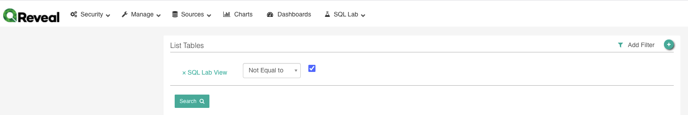
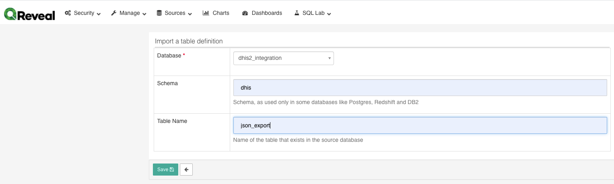
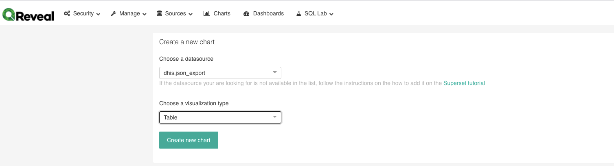
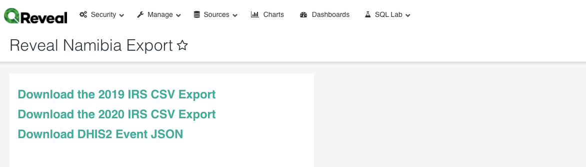

*OpenSRP Interventions Integration with DHIS2 via Superset - Phase 1: Manual Export*

**Preamble**

This solution enables exchange of information between Reveal and DHIS2 without the need for programmatic software integration. It allows data from a single Reveal activity or form to be pushed into DHIS2 program which has one stage with no registration. The solution consists of a dhis schema within the Reveal data warehouse database. This schema contains:

* a number of mapping tables which need to be populated with DHIS2 metadata detailing the program, program stage, data elements, attribute option combinations and organisational units

* A function which performs the transformation of the Reveal data into DHIS2 json

* A table populated by the above function which contains the DHIS2 json and is queried by Superset to allow for download 

Reveal Superset relies on a materialized view to provide transformed data to the frontend and api. These data are pushed into the data warehouse as raw json events from OpenSRP by Nifi. A materialized view is created from the parsed json and is refreshed according to a specified schedule. The json documents are flattened into a tabular format using [postgres json notation ](https://www.postgresql.org/docs/12/functions-json.html).

**Setup**

Database setup

1. Download the .sql file from github

2. Provide a public ssh key to Ona  - this can be created in github. Ona will add this to the server to allow ssh access

3. Obtain database and ssh server address from Ona

4. Request for your static ip address to be whitelisted for access to the ssh server

5. Run the .sql file - this will create the schema, tables and the function

6. Install [pgadmin4](https://www.pgadmin.org/download) or a similar tool , and connect to the data warehouse postgres database

7. Verify that the dhis schema is available and contains the following tables

    1. dataelements: mapping of Reveal form fields to dhis2 data elements

    2. datavalues: a volatile table that is used to temporarily store the data to be sent to DHIS2

    3. disaggregations: mapping of Reveal operational areas to DHIS2 category combinations. For use when DHIS2 unit of operation is disaggregated by a category combination

    4. events: a non-volatile link between Reveal events and DHIS2 events. Thi is needed for updates to DHIS2 events, do not truncate this table once it has been populated

    5. json_export: the destination table that Superset will select from 

    6. metadata: metadata used to configure the integration

    7. orgunits: mapping of Reveal jurisdictions to DHIS2 organisation units

8. Schedule the function to run regularly, at the same cadence as the materialized view refreshes. This will need to be done using crontab in the same way that the materialized view refreshes are scheduled

**DHIS2 Metadata**

Links below are to the DHIS2 demo environment. Please replace the domain and uids with your DHIS2 address. All data pulled from DHIS2 should be added to a spreadsheet for later reference.

1. Get the [program metadata]( [https://play.dhis2.org/2.32.7/api/programs](https://play.dhis2.org/2.32.7/api/programs)) and find the program that you would like to populate. The Information Campaign has been used as an example. 

2. Get the [program stage metadata]([https://play.dhis2.org/2.32.7/api/](https://play.dhis2.org/2.32.7/api/programs)[programStages](https://tland.hispmoz.org/namb/api/programStages)) and find the program stage that you will be using

3. Get the metadata for that program from [https://play.dhis2.org/2.32.7/api/programs](https://play.dhis2.org/2.32.7/api/programs)/q04UBOqq3rp   and record the categoryCombo id and the program stage id that you will be using

4. Download a file of the data elements for the program stage from https://play.dhis2.org/2.32.7/api/programStages/pSllsjpfLH2[.xml?fields=programStageDataElements[dataElement[id,displayName]]&pageSize=10000](https://tland.hispmoz.org/namb/api/programStages/TyCA5rQedpr?fields=programStageDataElements[dataElement[id,displayName]]&pageSize=10000])

5. Download a csv of the category option combinations [https://play.dhis2.org/2.35.1/api/categoryCombos/bjDvmb4bfuf.csv?fields=categoryOptionCombos[id,displayName](https://play.dhis2.org/2.35.1/api/categoryCombos/bjDvmb4bfuf.csv?fields=categoryOptionCombos[id,displayName]) using the categoryCombo id from the program

6. Download a csv of the organisation units for the program from [https://play.dhis2.org/2.35.1/api/programs/q04UBOqq3rp.csv?fields=organisationUnits[id,displayName]&pageSize=10000](https://play.dhis2.org/2.35.1/api/programs/q04UBOqq3rp.csv?fields=organisationUnits[id,displayName]&pageSize=10000)

**Reveal Metadata**

1. Login to the postgres database using the credentials supplied 

2. Locate the production schema, usually named ‘[country]_prod’

3. Get the list of Reveal form fields from the table ‘event_columns’

4. Get the list of Reveal Jurisdictions  from the table ‘jurisdictions’

    1. For programs using categoryCombos to disaggregate operations areas, get two lists of jurisdiction, one at the lowest level of the Reveal jurisdiction hierarchy which will map to the disaggregations, and one at the level above that which will map to the organisational units

**Mapping**

1. Populate the metadata table

    1. If the DHIS2 program is capturing events using a category combination for operational areas then

    2. If the DHIS2 program is capturing events without a category combination

2. Add each of the DHIS2 data elements to the data elements table

3. Map each Reveal form field to a data element - addition and subtraction is possible by adding a formula to the column. If there is no calculation needed, and the reveal element name to the field

4. If using category combinations, add each of the option combination to the disaggregation table

5. Map each Reveal operational area uuid to the disaggregation table

6. Add each of the DHIS2 organisation units to the organisation unit table

7. Map each Reveal jurisdiction 

**Scheduling**

1. The population of the dhis.json_export table should be scheduled alongside the materialized view refreshes

2. This will need to be done on the Data Warehouse database server using cron

**Superset**

1. Create a new table

2. Create a new chart

    1. Add the chart to the dashboard

    2. Amend the dashboard to specify to download a csv

3. Download the CSV from the dashboard

4. Open the csv in a text editor and replace all double quotes with single quotes 

5. Remove the first line of the csv

6. Replace "{ with {

7. Replace }" with }

8. Replace ]" with } 

9. Save the csv as a json file with an appropriate name

**DHIS2 Import**

1. Navigate to DHIS Import/Export Module

2. Click on ‘Event Import’

3. Select the file to import, select ‘JSON’ as the Format

4. Click Import

**Caveats**

1. Changes to DHIS2 data elements and data element data types will require a fresh mapping of DHIS2 and Reveal element

2. Significant effort to map Reveal fields to DHIS2 fields (data elements, organisation units etc) is needed when setting up the integration

3. There needs to be a direct connection to the postgres database available - this can be challenging in terms of networking when a private network is in use

**Next Steps**

1. A middleware component should be built to enable automatic submission of Reveal data through the DHIS2 api, negating the need for manual download and upload, and manipulation of the CSV file

2. Superset should be accessed via the API rather than the front end, using JSON rather than CSV

